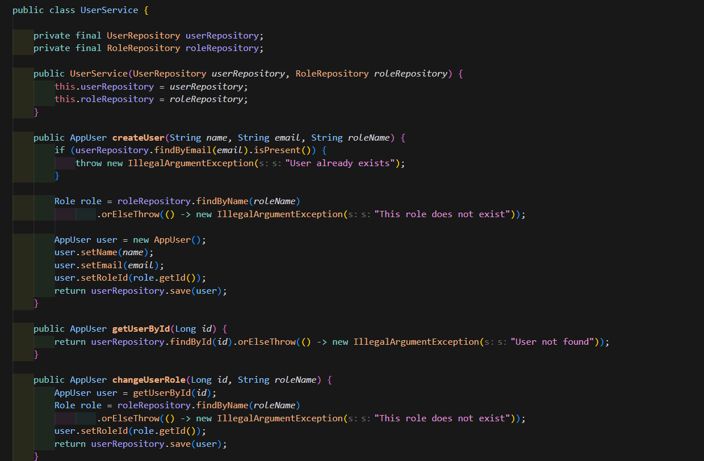

## 7th of September 2026
Today I started building the intial parts of the app. I started by first designing inside a [draw.io](http://draw.io) file the structure of the layers such as controller -> service -> repository -> postgreSQL. Also I made some diagrams for the User and Role model. This gave me a brief idea of what I will build and how it all connects with eachother.

.png)

I then installed postgreSQL on my local computer. I installed version 18 which should not be any issue for this simple app. I got recommended version 16 or 17 but eventually downloaded version 18 by mistake and I was to proud to admit a mistake so I just kept going.

Then I built the models User and Role and added JPA annotations to it so it connects with the database at runtime. I started the application and succesfully created two tables inside pgAdmin (the UI for postgreSQL) so the first step of building the backend is officially met. I made sure to keep all sensible credentials inside an .env file that github ignores. 

I have used AI as a mentor for this project. I have set strict rules so that the AI doesn't go bananas and starts taking over the project. It knows to guide me as a mentor and show me the different alternatives I can choose.

So far the project is going good. I have decided not to mention anything on LinkedIn this time because each time I talk about a project on LinkedIn I usually drop it. Evil eye or laziness? We'll see.

Last note. I discovered the Project Board on Github where I can set up all the objectives and tasks I need to work on. Amazing tool to keep track of the tasks. I then had a crazy idea to connect Cursor to that project board. Cursor already has access to my Github but could it connect to my project board and access the tasks and upload new tasks? Turns out it can. I think this will be very useful for the project and keep the flow of work very smoothly.

.png)

# 9th of September 2026 
##### 9:52
Today we keep going. Last coding session I made the first connection between the Java application and my local postgreSQL server. It connected succesfully. Today I will focus on making the repository level. I had three layers in mind. Controller -> Service -> Repository. After today's session I hope to be done with the Repository level and be able to create a user and save in my local database. Now the user-creation logic will not be written on the repository level, this will be done in the service level. But I will probably write a temporary code on the repository level to see if it works first. 

#### 11:47
So right now I am planning, will I make one table row for users and one separate row for roles and then match them with a foreign key like role_id? Or should I make one user table with the role embedded in the table like "COACH" or "PLAYER"? It seems that making two separate roles is the most scalable option. It might be overkill for this project but you never know where a project lands. So let's make it scalable. 

So what makes it scalable? The idea is that by having a set of roles inside an own table I can make the following: 
	1 - Limit the amount of allowed roles so that no "fake" role gets stored by accident. 
	2 - Add permissions on top of the role instead of writing it within each user. Meaning instead of writing it inside the user like "read_parents_phone" and have to repeat that for every user with that permission - we can just add it onto the role itself and it just repeats once. For this small project with 4 roles it might not make the biggest impact in terms of speed and memory but I would like to build something that can expand. 
	3 - If I later decide to expand the application I can make other tables that point towards the role table, if I want to add new functionalities etc. 

#### 12:32 
One idea that I am discussing in my head now is if I should have a separate table for permissions. For example, READ_PARENTS_PHONE or READ_PLAYER_ADRESS, and then give each permission an ID that the role can point to. So COACH has permission 1,2,3 etc and it points to a set of permissions in another table. 

I have added it onto the project board. 

#### 13:23
I have now connected JPA to the local postgreSQL server on my computer. 

Both for the User repository and the Role repository.

#### 19:52
Last log for today. I have now finished the Repository layer and the Service layer. They are of course not 100% done, there is a lot of security left to work on the service layer but enough to now build a controller layer and test my API from Postman. 

I also made a RoleSeeder to push in data straight into the database upon start to see if the data was passing through correctly. Images show success. 

This is the code that runs whenever the API is started

And this is the data inside the database that made it through. Next step is making a controller layer where we will create an user from it. 

### 13th of September 2026
####  13:45 
Today I made the controller layer. Very basic structure but managed to create an user through Postman.

And when we look into PostgreSQL we see that the user is indeed stored in the database. 

So this is a big first success. I made sure to use a DTO to transfer data between the controller layer and the service layer. At the moment there is no sensible data to protect but it will be added later on so it's good to set the foundation. 

### 15th of September 2026
#### 15:06 
Today I am working on adding some more endpoints to the controller layer. It's currently missing a PUT endpoint to change the user role so that we can change someone from PLAYER to COACH for example. At the beginning everyone will be able to make this call, later on I will add some security on top it so only COACH and ADMIN can make these role changes. 

#### 16:09
The more I am coding in Cursor the more I see that not every suggestion I get from AI is the right suggestion. When making the endpoint to change the user's role I got the suggestion from AI to use the same DTO that I use when creating an user. Meaning that whenever I update the user's role I will get back their ID, their name, their email and whatever extra data I add later on. I decided to show Cursor who is in command and decided to make a separate DTO for changing roles. That way whenever we update the user role we only get back from the database the user id and the new role to confirm the change. I think that's way cleaner. 

This is my controller logic for updating the user role. It now uses a separate DTO so that we don't send more data than what's needed. I think using the same DTO for different purposes just messes the structure and I prefer to have more classes with individual purposes. Even if they have the same data inside I think I would still make separate classes just in case I want to change something in it later. 

#### Testing changing the user role 
#### 20:15 

In the image above is the user saved in the local database. The role id is 2 which points to COACH in another table.  As seen in the image below. 

Now I will make a PUT request to the API using Postman and send the new role in a String format. 

This is the response I got. A full 200 OK and I got the user ID returned back as well as the new role thanks to the DTO I made earlier specific for this API call. 

The response shows PLAYER instead of COACH now. That means that if I make a GET request for this user I should receive PLAYER as their role as well. 

Which turned out to be correct. That means also that If I search up the user inside my local database I should see the user have a role id of 3 instead of 2. 

Works like a charm. So far so good. I still haven't tested too see what happens when I send an invalid role. Let's see what happens if I send ARTIST for example. 

I got a 500 server error. That's good. It means that some security is applied. I still haven't made any error exceptions yet so that's why I am getting a standard 500 internal server error. Later on when I fix the exceptions it should throw a 400 bad request error. That reminds me also that I should make createUser return status 201 which stands for CREATED instead of just returning 200 OK.  I have added this now as a TODO list inside the code. 

Here is a showcase of all our API endpoints we can call right now from our controller. 

And here is an image that shows how to practically use them.

#### 9:15
Right now I am battling a new question that I hadn't thought about. What if a coach wants to remove a player from the club? Then we just make a simple deleteUser like any CRUD application right? But what if the club in the future needs to have a log of the players that were active last year? Or they temporarily inactivate a player because misbehavior and then lets him join again, or what if a player is permanently banned from the club and the player tries to rejoin again after a couple of years and the club needs a way to see if this user has been in the club previously?. 

That means that we need a table of inactive users and we need to store their data for a longer period. I am not sure how long I can save their personal data on our database according to GDPR. I would have to look that up. 

Then there is another issue linked to that. Every player is linked to a parent or two parents. If a player gets inactivated - should his parents also get inactivated automatically? What if a parent has more than one child in the club? Then we need to have a code that checks if the inactive player has a parent with more players attributed to it, if there are no more players then the parent gets automatically inactivated together with the player. If there are more players attributed to the same parent then only the player gets inactivated. This sounds like it's too early to build right now so I will therefore skip deleteUser for now. 

#### 22:00
After some discussion with Grok I got a good suggestion. Instead of having a separate table of inactive users I can just have an attribute called active and then just have a boolean true or false on it. That way we skip having double data in the database and we skip having issues with messy joins. But this will probably be for another version of the app. Not now. 

I have updated CreateUser to return a DTO instead of the actual AppUser. Now when creating an user instead of returning the role ID it's returning the role in String format. As seen below. 

### 17th of September 2026
#### 13:25 
Last session I started noticing something. The idea of what the project should be started to blur out in my mind. I started forgetting what I needed to prioritize and what I needed to ignore. Luckily I have made this mistake a dozen times. Previously I have just kept going and ended up with spaghetti code with no clear idea of what to do. This time I caught myself. The issue I had is that in the beginning of the project I made an idea of what version 1 of this app should look like. While coding along I started to forget this and started bringing new ideas and started to drift away from the plan. 

So I realized that I need to change how I work and plan. I have decided to start working Agile in Jira to keep track of the work and plan ahead. Agile framework and SCRUM is a framework that I am currently studying in school and I honestly really liked it. I am even considering applying for jobs as project leaders / scrum masters. So I will apply it to this project. The only issue is that I am working solo and I have no team. But I asked my teacher about it and she said that it's no issue, you just have to take away some of the daily routines that would otherwise be part of the scrum if you are in a team such as daily scrum meetings. 

I have created an account in Jira now. I tried to connect Jira to Cursor so that Cursor can fetch my user stories and tasks and then discuss with me. However I think that Jira has a paid plan if you want to connect it to AI. And I am... well, not rich yet so I will use Jira manually. No I am not poor. I just have a household with high economic metabolism. 

I am also making a rule file in Cursor telling it how we should think when working in scrum. In this file I tell Cursor how to think about scrum, how we need to write our user stories, what to write inside them and how clear the tasks should be. Some of the rules I gave it: 

- All epics and user stories must use non-technical language. 
- Tasks may use technical language and should have clear instructions of what needs to be fixed/added/removed, why and what the outcome should be after the task is done. 
- Before the sprint is done, all core functions should have been tested. 
- Have a clear idea of what "done" means before starting the sprint. 

Here are some Epics I have written.

And inside one of the Epics I have written a bunch of User Stories. I have taken help of AI to brainstorm these Epics and User Stories. Although I haven't relied solely on the AI. I have used it as a tool to brainstorm. Some ideas were good and some I discarded. 

#### 15:39
Haven't written a single letter of code yet. I am still puzzling around with Jira and at the same time discussing with Cursor AI how to best store the user data. I feel somewhat worried about storing sensible user data in my database. Specially the behavior notes, that is sensible and private data that could damage the club if it leaked. I think it's more serious if the behavior notes leaked than if the name and phone number and address leaked. Because the behavior notes can be used to black-mail, to damage one's reputation and relationships. 

I am also looking into Identity Providers (IdP). I first thought about EntraId from Microsoft but after further research it turns out they need a Microsoft account for that and I don't want to force the players and parents to get a Microsoft account...  I am looking into alternatives such as Auth0 or AWS Cognito. 

The reason I want an IdP is more that I don't want to store login credentials and I don't want to code the login logic. Since I am working with Java I prefer to work with JSON Web Tokens (JWT) and let the IdP authenticate the user and just send a confirmation to the client (app) if the authentication was successful. But I won't dive deep into it now, I will focus on making the API logic work first. The login logic is just a security layer on top of the API in order to prevent API calls from the wrong callers. 

#### 16:34

I have connected Jira to my Github repository. I only gave it access to the projects repository and no other. Apparently you can create branches from inside Jira, I will experiment with it a bit. 

#### 17:06 
I am tired man. I have been writing stories for each epic and subtasks for each story. I will showcase some of the stories and subtasks. 

This is the epic I am focusing on . The staff (admins and coaches) should be able to create users, alter their data and fetch their data. Inside the epic I have made user stories with clear structures. "As __ I want to __ because of ". That keeps me focused on WHO I am making this for and WHAT the user expects on their side. 

Although I want to bring to notice something important, I have yet not had a conversation with the football club. I have talked to my wife's father who is the owner of the club but he is not an active coach on a daily baisis. He steps in sometimes and helps but overall there are other coaches managing that. I need to have a sitting with one of the coaches at least to make sure these user stories are fine tuned. But I am waiting until one of the coaches is coming back from his trip abroad. But I have poor patience so I will keep going and hopefully I have understood their needs right. 

Here is inside an user story. Inside it I have made subtasks for the developer (me). The language is technical now. I have made the end goal the main title of the task. I will show you inside of it. 

Inside it I have used AI to generate clear instructions on what to do. What file to edit, what do edit. Why we edit, and how we know that this task is done. 

I have given myself 4 weeks to finish this sprint because of two reasons. I am not fully warm in the Jira clothes yet so I have a brief learning curve ahead. And I will be traveling for one week and will probably not ship any code. 

### 18th of September 2026
#### 16:44
Today I have worked on the first part of my sprint. I implemented a function to search for an user's name in the database. I made findByNameContainingIgnoreCase in the repository level, meaning that it looks up the Name attribute in AppUser, and it looks to see if the name contains the word we are searching for and it also doesn't look into uppercase nor lowercase. So searching for "Er" should return Erik. Searching for "E" should return Marcel and Erik and so on. 

In the service layer I added the function searchByName which just calls the repository layer. I added some filter on it so that the user can't send a blank string. This functions returns a list of users back to the controller layer. 

In the controller layer I added this endpoint and added a RequestParam so that we can write the query inside the URL in Postman. The logic is simple, it fetches a list of users from the database that contains the search word then maps them into a DTO response that it sent to the client. If the user sends a blank name it gets a 500 server error. This will be turnt into a 400 bad request error later on. 

So far I have made 2 out of 4 stories in my sprint. I will take a break today because I am unsually tired. But at least I got something shipped today.

### 23th of September 2026
#### 08.29
I have been awake since 12:30 the day before. I just came home from my night shift and in 30 minutes I have my school class. I am a bit stuck in the project now because one of the coaches of FC Växjö showed me a website: www.svenskalag.se/. Apparently they offer website, mobile app and payment options for sport clubs. They have really good offers and it made me honestly doubt if I should continue this project. 

I could be egoistic and push forward just to have a project on my portfolio, but would FC Växjö really benefit from this? Would it not be better for them to go with svenskalag.se instead? These are the questions I am fighting these days. Hopefully I get a clear idea soon. 