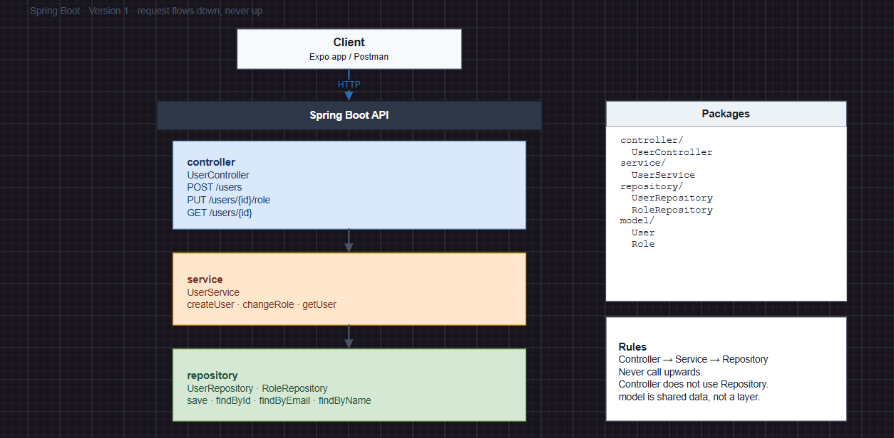

## 7th of September 2026
Today I started building the intial parts of the app. I started by first designing inside a [draw.io](http://draw.io) file the structure of the layers such as controller -> service -> repository -> postgreSQL. Also I made some diagrams for the User and Role model. This gave me a brief idea of what I will build and how it all connects with eachother.

.png)

I then installed postgreSQL on my local computer. I installed version 18 which should not be any issue for this simple app. I got recommended version 16 or 17 but eventually downloaded version 18 by mistake and I was to proud to admit a mistake so I just kept going.

Then I built the models User and Role and added JPA annotations to it so it connects with the database at runtime. I started the application and succesfully created two tables inside pgAdmin (the UI for postgreSQL) so the first step of building the backend is officially met. I made sure to keep all sensible credentials inside an .env file that github ignores. 

I have used AI as a mentor for this project. I have set strict rules so that the AI doesn't go bananas and starts taking over the project. It knows to guide me as a mentor and show me the different alternatives I can choose.

So far the project is going good. I have decided not to mention anything on LinkedIn this time because each time I talk about a project on LinkedIn I usually drop it. Evil eye or laziness? We'll see.

Last note. I discovered the Project Board on Github where I can set up all the objectives and tasks I need to work on. Amazing tool to keep track of the tasks. I then had a crazy idea to connect Cursor to that project board. Cursor already has access to my Github but could it connect to my project board and access the tasks and upload new tasks? Turns out it can. I think this will be very useful for the project and keep the flow of work very smoothly.

.png)

# 9th of September 2026 
##### 9:52
Today we keep going. Last coding session I made the first connection between the Java application and my local postgreSQL server. It connected succesfully. Today I will focus on making the repository level. I had three layers in mind. Controller -> Service -> Repository. After today's session I hope to be done with the Repository level and be able to create a user and save in my local database. Now the user-creation logic will not be written on the repository level, this will be done in the service level. But I will probably write a temporary code on the repository level to see if it works first. 

#### 11:47
So right now I am planning, will I make one table row for users and one separate row for roles and then match them with a foreign key like role_id? Or should I make one user table with the role embedded in the table like "COACH" or "PLAYER"? It seems that making two separate roles is the most scalable option. It might be overkill for this project but you never know where a project lands. So let's make it scalable. 

So what makes it scalable? The idea is that by having a set of roles inside an own table I can make the following: 
	1 - Limit the amount of allowed roles so that no "fake" role gets stored by accident. 
	2 - Add permissions on top of the role instead of writing it within each user. Meaning instead of writing it inside the user like "read_parents_phone" and have to repeat that for every user with that permission - we can just add it onto the role itself and it just repeats once. For this small project with 4 roles it might not make the biggest impact in terms of speed and memory but I would like to build something that can expand. 
	3 - If I later decide to expand the application I can make other tables that point towards the role table, if I want to add new functionalities etc. 

#### 12:32 
One idea that I am discussing in my head now is if I should have a separate table for permissions. For example, READ_PARENTS_PHONE or READ_PLAYER_ADRESS, and then give each permission an ID that the role can point to. So COACH has permission 1,2,3 etc and it points to a set of permissions in another table. 

I have added it onto the project board. 

#### 13:23
I have now connected JPA to the local postgreSQL server on my computer. 

Both for the User repository and the Role repository.

